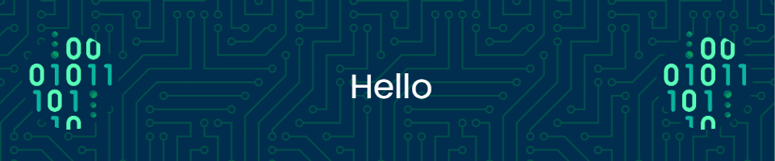

 

## 🚀 about me

Innovative software engineer with a passion for crafting elegant solutions and transforming ideas into reality. A strategic thinker and problem solver, I love challenges and collaboration to build remarkable software products! Let's connect and duke it out in code!

 

## 💻 programming languages

Over the past years, I have developed a set of development arsenal to create beautiful solutions to complex and difficult problems. Here are the languages that I ❤️ the most,

    
	
    
    
	

    
	
    

 

## 🤖 technology

    
    
    
    

 

## ⚽ projects

TBD

 

## 🏢 work experience

TBD

 

## 🤝 connect w/ me

    <!-- Replace href with your links -->
    

 

### 👾 stats for the nerds

  
  

  

